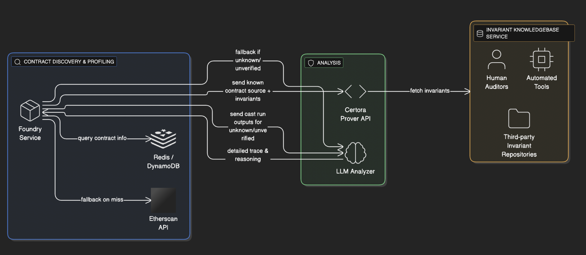

# Penpie Hack Post Mortem Audit

This repository contains a proof-of-concept (PoC) of the Penpie protocol hack that occurred on September 3, 2024. The attack exploited vulnerabilities in the Pendle and Penpie integration, resulting in approximately $27 million USD in losses.

## Overview

The Penpie hack was a sophisticated attack that exploited the reward distribution mechanism in Penpie's integration with Pendle Finance. The attacker created a malicious Standard Yield (SY) token and corresponding Pendle market to manipulate reward calculations and drain funds from legitimate users.

## Attack Mechanism

### Key Components

1. **Evil SY Token**: A malicious Standard Yield token that implements fake reward distribution
2. **Fake Pendle Market**: A market created using the evil SY token
3. **Reward Manipulation**: Exploiting the `claimRewards` function to drain real assets
4. **Flash Loan**: Using Balancer flash loans to amplify the attack

### Attack Flow

1. **Setup Phase**:
   - Deploy malicious SY token contract
   - Create Principal Token (PT) and Yield Token (YT) using the evil SY
   - Create a fake Pendle market with manipulated parameters
   - Register the fake market with Penpie (exploiting permissionless registration)

2. **Preparation Phase**:
   - Mint fake tokens to establish initial state
   - Approve necessary contracts for token transfers
   - Deposit minimal amounts to activate the market

3. **Execution Phase**:
   - Take flash loans of agETH and rswETH from Balancer
   - Trigger reward harvesting on the fake market via `PendleStakingBaseUpg::batchHarvestMarketRewards()`
   - **Reentrancy Exploit**: During the reward harvesting process, the malicious SY contract re-enters the `PendleStakingBaseUpg::depositMarket()` function
   - The malicious `claimRewards` function:
     - Converts flash-loaned tokens to SY tokens
     - Repeatedly deposits them into legitimate Pendle markets through reentrancy
     - Manipulates reward token amounts sent to the fake market depositor (the attacker)
     - Claims inflated rewards from Penpie
   - Withdraw the deposited amounts plus manipulated rewards
   - Convert back to original tokens
   - Repay flash loans and keep the profit

### Root Cause Analysis

The attack exploited two key vulnerabilities:

1. **Reentrancy Vulnerability**: The `PendleStakingBaseUpg::batchHarvestMarketRewards()` function lacked proper reentrancy protection, allowing the malicious SY contract to re-enter `PendleStakingBaseUpg::depositMarket()` during reward harvesting. This enabled the attacker to repeatedly add new deposits sourced from flash loans and manipulate reward calculations.

2. **Permissionless Registration Design**: While Penpie's open system for permissionless registration of new Pendle markets is conceptually sound, it enabled the attacker to register a fake Pendle market with a malicious SY contract. This design choice, combined with insufficient validation of market authenticity, provided the entry point for the exploit.

The combination of these factors allowed the attacker to manipulate the reward distribution mechanism and drain funds from legitimate users.

## Repository Structure

```
├── PoC/
│   ├── src/
│   │   └── interfaces/          # Interface definitions
│   │       ├── pendle/          # Pendle protocol interfaces
│   │       ├── penpie/          # Penpie protocol interfaces
│   │       └── balancer/        # Balancer protocol interfaces
│   ├── test/
│   │   ├── Attack.t.sol         # Main attack reproduction test
│   │   └── Cheatsheet.sol       # Helper utilities
│   └── lib/
│       └── forge-std/           # Foundry standard library
├── PendleMarketV3/              # Pendle Market V3 contracts
├── PendlePrincipalToken/        # Pendle Principal Token contracts
├── PendleStaking/               # Pendle Staking contracts
└── README.md                    # This file
```

## Prerequisites

- [Foundry](https://book.getfoundry.sh/getting-started/installation)
- Access to Ethereum mainnet RPC (e.g., Alchemy, Infura)
- Git

## Setup Instructions

1. **Clone the repository**:
   ```bash
   git clone <repository-url>
   cd penpie-hack-demo
   ```

2. **Initialize submodules**:
   ```bash
   git submodule update --init --recursive
   ```

3. **Install dependencies**:
   ```bash
   cd PoC
   forge install
   ```

4. **Set up environment**:
   Create a `.env` file in the `PoC` directory with your RPC URL:
   ```
   ETH_RPC_URL=https://eth-mainnet.g.alchemy.com/v2/YOUR_API_KEY
   ```

## Running the Attack

1. **Navigate to the PoC directory**:
   ```bash
   cd PoC
   ```

2. **Run the attack simulation**:
   ```bash
   forge test --match-test test_completePenpieAttack -vvv --fork-url $ETH_RPC_URL
   ```

   The test will fork Ethereum mainnet at block 20671877 (just before the attack) and simulate the entire attack sequence.

3. **Expected Output**:
   The test should show the final balances of agETH and rswETH tokens that the attacker obtained.

## Key Contracts and Addresses

### Target Tokens
- **agETH**: `0xe1B4d34E8754600962Cd944B535180Bd758E6c2e`
- **rswETH**: `0xFAe103DC9cf190eD75350761e95403b7b8aFa6c0`

### Pendle Protocol
- **Router V4**: `0x888888888889758F76e7103c6CbF23ABbF58F946`
- **Market Factory V3**: `0x6fcf753f2C67b83f7B09746Bbc4FA0047b35D050`
- **Yield Contract Factory**: `0x35A338522a435D46f77Be32C70E215B813D0e3aC`
- **Market Register Helper**: `0xd20c245e1224fC2E8652a283a8f5cAE1D83b353a`
- **Market Deposit Helper**: `0x1C1Fb35334290b5ff1bF7B4c09130885b10Fc0f4`

### Penpie Protocol
- **Master Penpie**: `0x16296859C15289731521F199F0a5f762dF6347d0`
- **Pendle Staking**: `0x6E799758CEE75DAe3d84e09D40dc416eCf713652`

### External Protocols
- **Balancer Vault**: `0xBA12222222228d8Ba445958a75a0704d566BF2C8`

## Technical Details

### Malicious SY Token Implementation

The `AttackingContract` implements a fake Standard Yield token with the following key features:

- **Fake Asset Info**: Returns itself as the underlying asset
- **Manipulated Exchange Rate**: Returns 1:1 exchange rate
- **Malicious Reward System**: The `getRewardTokens()` and `claimRewards()` functions are designed to return real SY tokens (agETH and rswETH SY) when called by the fake market

### Critical Vulnerability

The vulnerability lies in the trust relationship between Penpie and Pendle markets. Penpie assumes that any registered Pendle market will behave honestly when reporting rewards. The attacker exploited this by:

1. Creating a fake market that reports real SY tokens as rewards
2. Using the fake market to claim rewards from Penpie
3. Converting those rewards back to underlying assets for profit

## Debugging the Attack

To debug specific parts of the attack:

1. **View transaction traces**:
   ```bash
   forge test --match-test test_completePenpieAttack -vvvv
   ```

2. **Debug specific functions**:
   Add `console.log` statements in the test file to track token balances and contract states.

3. **Analyze on-chain data**:
   The original attack transaction can be found at: `0x7e7f9548f301d3dd863eac94e6190cb742ab6aa9d7730549ff743bf84cbd21d1`

## Mitigation

The vulnerability was patched by implementing proper validation of market authenticity and reward token verification. Key mitigations include:

1. **Market Validation**: Verify that markets are legitimate Pendle markets
2. **Reward Token Verification**: Ensure reward tokens match expected SY tokens
3. **Access Controls**: Implement stricter access controls for reward claiming

## Prevention Strategies

This attack could have been prevented through defensive measures implemented by any of the three protocols involved:

### Penpie Protocol Defenses

1. **Reentrancy Protection**:
   - Implement proper reentrancy guards on `batchHarvestMarketRewards()` and `depositMarket()` functions
   - Use OpenZeppelin's `ReentrancyGuard` or similar patterns
   - Follow checks-effects-interactions pattern

2. **Market Validation**:
   - Implement a whitelist of verified Pendle markets instead of permissionless registration
   - Add validation to ensure registered markets are authentic Pendle contracts
   - Verify that SY tokens in markets are legitimate and not malicious contracts

3. **Reward Token Verification**:
   - Validate that reward tokens returned by markets match expected SY tokens
   - Implement sanity checks on reward amounts to detect anomalous distributions
   - Add rate limiting on reward claims per market

4. **Access Controls**:
   - Implement time delays for new market registrations
   - Require governance approval for new market additions
   - Add emergency pause functionality for suspicious activity

### Pendle Protocol Defenses

1. **Market Factory Validation**:
   - Add stricter validation in `createNewMarket()` to ensure SY tokens are legitimate
   - Implement checks to prevent creation of markets with malicious SY contracts
   - Validate that SY tokens implement expected interfaces correctly

2. **SY Token Standards**:
   - Enforce stricter standards for SY token implementations
   - Add validation for `getRewardTokens()` and `claimRewards()` return values
   - Implement checks to ensure SY tokens don't return arbitrary reward tokens

3. **Market Registration Controls**:
   - Add approval mechanisms for market registration with external protocols
   - Implement monitoring for unusual market behavior
   - Provide tools for external protocols to validate market authenticity

### Balancer Protocol Defenses

1. **Flash Loan Monitoring**:
   - Implement monitoring for flash loans used in complex DeFi interactions
   - Add alerts for flash loans that interact with multiple protocols in single transaction
   - Consider rate limiting or cooling periods for large flash loans

2. **Recipient Validation**:
   - Add optional validation mechanisms for flash loan recipients
   - Implement reputation systems for frequent flash loan users
   - Provide tools to detect potentially malicious flash loan patterns

3. **Integration Safeguards**:
   - Offer integration guidelines for protocols using flash loans
   - Provide security recommendations for flash loan recipients
   - Consider implementing circuit breakers for unusual activity patterns

### Cross-Protocol Considerations

1. **Standardized Security Practices**:
   - Establish industry standards for cross-protocol integrations
   - Implement shared security frameworks for DeFi composability
   - Create common validation patterns for external contract interactions

2. **Monitoring and Alerting**:
   - Implement cross-protocol monitoring for unusual transaction patterns
   - Share threat intelligence between protocols
   - Establish rapid response mechanisms for detected attacks

3. **Economic Safeguards**:
   - Implement economic penalties for malicious behavior
   - Add bonding requirements for market creators
   - Consider insurance mechanisms for cross-protocol risks

The most effective prevention would have been **Penpie implementing proper reentrancy protection**, as this was the core vulnerability that enabled the attack. However, defense-in-depth approaches from all protocols would provide the most robust protection against sophisticated attacks.

## Disclaimer

This repository is for educational and research purposes only. The code demonstrates a historical vulnerability that has been patched. Do not use this code for any malicious purposes.

## References

- [Penpie Protocol](https://www.penpie.io/)
- [Pendle Finance](https://www.pendle.finance/)
- [Original Attack Analysis](https://rekt.news/penpie-rekt/)
- [Foundry Documentation](https://book.getfoundry.sh/)

# Solution Architecture

My proposed solution involves using Certora Prover API to scan for re-entrancy vulnerabilities in the scope of any contract involved in the execution of transactions that make use flashloans.

First, a Foundry back-end service compiles all the contract addresses involved in the internal txs. This service makes use of a service that provides contract names, ABIs and source codes, the already profiled contracts are sourced from a low-latency DB (Redis or anything faster), and the unkown ones are attempted to be sourced from Etherscan API. If none of the previous methods work (i.e. unknown and unverified contracts), then the whole (Foundry) `cast run` outputs are set to be analyzed by an LLM in search for suspicious behaviors.

For the cases where the source code is known, such source codes should be analyzed against a set of well-known invariants relevant to the smart contract's ontology. Such sets of invariants should be sourced from an Invariant Knowledgebase Service which in turn actively collects invariants and their relevant contexts as fed by human auditors.

